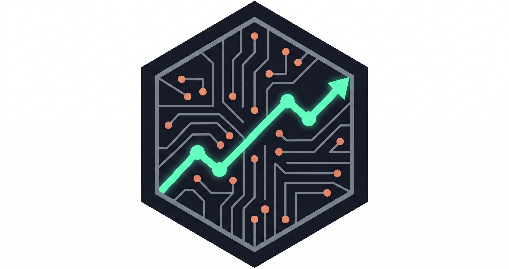

<div align="center">



# KORHEX.AI Enterprise

### AI-Powered B2B Account Intelligence Platform

[](https://python.org)
[](https://fastapi.tiangolo.com)
[](https://react.dev)
[](https://ollama.com)
[](LICENSE)

**Zero Data Leakage · 100% Local AI · Enterprise-Grade**

</div>

---

## The Problem It Solves

B2B sales teams waste hours manually researching target accounts across LinkedIn, news sites, financial reports, and tech databases. The information is scattered, outdated, and inconsistent — and using cloud-based AI tools risks leaking sensitive strategic data to third parties.

**KORHEX.AI automates that entire research process in under 2 minutes, without a single byte of data leaving your machine.**

---

## What It Does

Given a company name and website, KORHEX.AI runs a fully automated intelligence pipeline and produces a comprehensive commercial profile:

| Output | Description |
|--------|-------------|
| 🔍 **6-Section Intelligence Report** | Strategy, tech environment, pain points, decision makers, financial signals, competitive context |
| 📊 **Lead Score (0–100)** | Algorithmic prioritization based on inactivity, tech signals, and pain points |
| 🤖 **AI-Generated Sales Pitch** | Personalized enterprise pitch written by a CrewAI agent (150–350 words) |
| 📦 **Product Recommendations** | RAG-matched products from your own internal catalog |
| 🔒 **Privacy Audit** | Compliance check confirming all sources are public and no data was leaked |

---

## Architecture

KORHEX.AI is built on a modern, fully decoupled, async-first stack:

```
┌─────────────────────────────────┐
│  React 18 + Vite + Tailwind CSS │  ← Dashboard, live pipeline tracker,
│  (Single Page Application)      │    score breakdown, history
└────────────────┬────────────────┘
                 │ REST / SSE
                 ▼
┌─────────────────────────────────┐
│  FastAPI (async) + Pydantic V2  │  ← API validation, SSRF & prompt
│  SQLite WAL Cache               │    injection protection, 24h cache
└────────────────┬────────────────┘
                 │ local HTTP
                 ▼
┌─────────────────────────────────┐
│  Ollama — Llama 3 (local)       │  ← All LLM inference runs here.
│  CrewAI Multi-Agent Orchestration│   No OpenAI. No Anthropic. No cloud.
└─────────────────────────────────┘
```

---

## Key Technical Highlights

**⚡ Parallel Async Scraping & Domain Filtering**
All 6 intelligence queries run simultaneously via `asyncio.gather()`, reducing total scraping time from ~30s to ~8s. Fetching 15 results initially and stripping out all Blacklisted domains (consumer forums, Q&As like Zhihu/Quora) ensures only B2B quality web entries reach the AI.

**🗄️ Smart SQLite Cache**
Results are cached for 24 hours using WAL mode (safe for concurrent reads). Repeat analyses are returned instantly without re-running the LLM or scraper.

**🔐 Security-First Design**
- Prompt injection detection blocks 10+ attack patterns before they reach the LLM
- SSRF protection rejects private/internal IP addresses in company URLs
- All data stays on `localhost` — nothing is sent to external services

**🧩 OOP Design Patterns**
- **Strategy Pattern** — The scraper is injected via interface, making it swappable without touching agent code
- **Singleton Pattern** — The Llama 3 LLM instance is created once and reused across all requests
- **Result Dataclass** — Strongly typed output with computed properties like `is_high_priority`

**📡 Live Streaming**
The `/api/v1/analyze/stream` endpoint streams LLM tokens in real time via Server-Sent Events, allowing the UI to display the sales pitch as it's being written.

---

## Tech Stack

| Layer | Technology | Purpose |
|-------|-----------|---------|
| Frontend | React 18 + Vite + Tailwind CSS | SPA dashboard |
| Backend | FastAPI + Pydantic V2 | Async REST API |
| AI Agents | CrewAI | Multi-agent orchestration |
| LLM | Llama 3 via Ollama | Local inference (zero cloud) |
| Scraping | DuckDuckGo Search | Public web intelligence |
| Cache | SQLite (WAL mode) | 24h result caching |
| PDF Export | ReportLab | Professional report generation |

---

## Quick Start

**Prerequisites:**
- Python 3.12+
- Node.js 18+
- [Ollama](https://ollama.com/) installed and running

```bash
# 1. Pull the Llama 3 model locally
ollama run llama3
```

**Windows — one-click launch:**
```powershell
.\start.ps1
```

The app opens automatically at `http://localhost:5173`

---

## Manual Setup

```bash
# Backend
cd backend
.\venv_backend\Scripts\activate      # Windows
pip install -r requirements.txt
uvicorn main:app --reload --port 8000

# Frontend (separate terminal)
cd frontend
npm install
npm run dev
```

**Environment variables** (`backend/.env`):
```env
CORP_PROXY_URL=http://your-corporate-proxy:port   # Optional
JWT_SECRET=your_jwt_secret_key
```

---

## Project Structure

```
korhex-ai-platform/
├── backend/
│   ├── main.py                 # FastAPI app + async pipeline orchestration
│   ├── models/schemas.py       # Pydantic V2 request/response contracts
│   └── modules/
│       ├── scraper.py          # Async parallel DuckDuckGo scraper
│       ├── agents.py           # CrewAI dual-agent pipeline (Llama 3)
│       ├── agent.py            # OOP patterns: Strategy, Singleton, Dataclass
│       ├── database.py         # SQLite cache layer (WAL mode, 24h TTL)
│       ├── rag.py              # Product portfolio matching engine
│       └── pdf_report.py       # ReportLab PDF generation
├── frontend/
│   └── src/App.jsx             # React SPA — all components in one file
├── start.ps1                   # One-click launcher (Windows)
├── README.md                   # This file
└── TECHNICAL_DOCS.md           # Full technical documentation (Spanish)
```

---

## API Reference

| Endpoint | Method | Description |
|----------|--------|-------------|
| `/api/v1/analyze` | POST | Full analysis pipeline |
| `/api/v1/analyze/stream` | POST | Same, but streams LLM tokens via SSE |
| `/api/v1/export-pdf` | POST | Generates a PDF report |
| `/health` | GET | System status: Ollama, cache stats, token usage |

For the complete API contract with request/response schemas, see [TECHNICAL_DOCS.md](./TECHNICAL_DOCS.md).

---

## Security Policy

- **All LLM inference** runs at `127.0.0.1:11434` — never reaches the internet
- **Prompt injection** patterns are detected and rejected at the API boundary
- **Internal URLs** (localhost, 192.168.x.x, 10.x.x.x) are blocked (SSRF protection)
- **Sensitive files** (`.env`, `venv_backend/`, `node_modules/`, `*.db`) are excluded from version control

---

<div align="center">

Built with Python, React, CrewAI, and Llama 3 · A general-purpose B2B account intelligence platform

</div>
